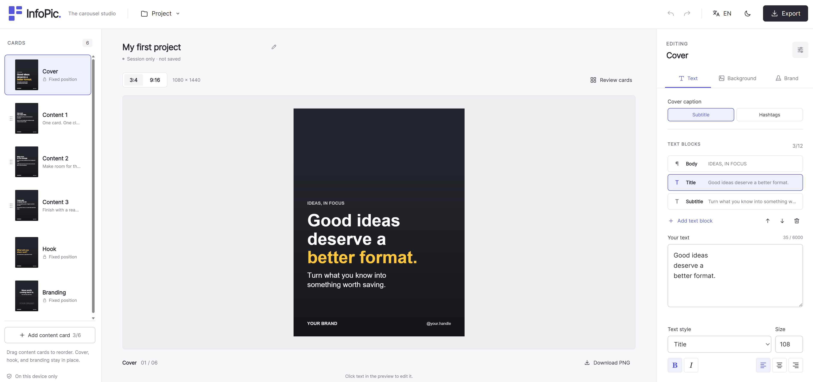
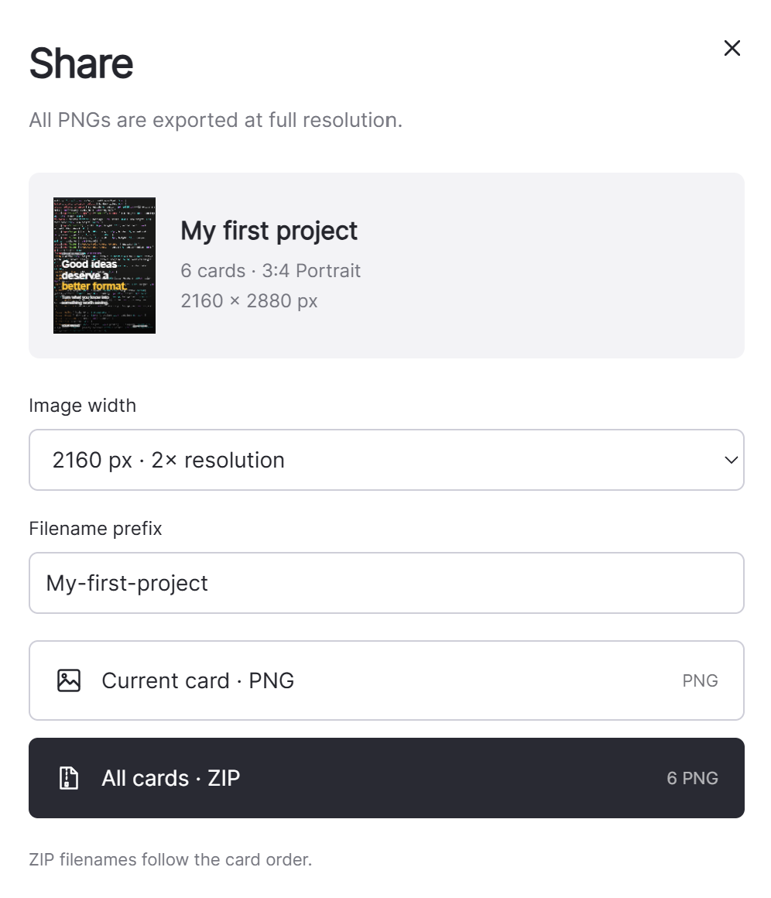

  

# InfoPic

[English](./README.md) | [한국어](./README-KR.md)

**Create informational carousels entirely in your browser.**

InfoPic is a lightweight editor for Instagram-style card sets, with built-in layouts for **cover → content → hook → branding**. It runs entirely on your device without a backend, account, AI service, or external API.

## Features

- **Structured layouts:** One cover, 3–6 reorderable content cards, one hook, and one branding card. Supports portrait **3:4** and **9:16** formats.
- **Text and branding:** Four text styles, alignment, bold/italic, logos, and up to three cover hashtags. Apply text and background colors to selected words using 10 presets or custom HEX values.
- **Project management:** Save and reopen projects, undo/redo edits, and optionally enable local backups.
- **Responsive interface:** English/Korean UI and light/dark themes for desktop, tablet, and mobile. Defaults to English and light mode.

## Background Editing

Fit, crop, scale, and position images, then adjust brightness, contrast, exposure, and saturation. Add a vignette at the top, bottom, or both edges, or darken the entire background with an adjustable black overlay.

## Export

Download the current card as a PNG or all cards as a ZIP, with filenames ordered by card sequence. Choose an output resolution without adding arrows, page numbers, or an InfoPic watermark to your images.

## Getting Started

Download or clone this repository and open `index.html` in a modern browser. Keep the `css/` and `js/` folders alongside it. No package installation or build step is required.

For web access, publish the repository root with GitHub Pages or another static host. Keep the `images/` folder to display the screenshots in these READMEs.

## Privacy and Fonts

The app does not upload your text, images, or fonts. Preferences and optional backups stay in your browser. Save a project file for long-term storage.

Multilingual text uses fonts installed on your device. Import a font you have permission to use if characters are missing.
